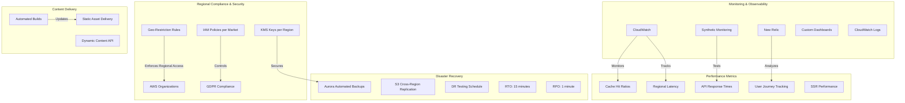

```mermaid
graph TB
    subgraph "Regional Compliance & Security"
        KMS[KMS Keys per Region]
        GEO[Geo-Restriction Rules]
        ORG[AWS Organizations]
        IAM[IAM Policies per Market]
        GDPR[GDPR Compliance]
    end

    subgraph "Monitoring & Observability"
        CW[CloudWatch]
        NR[New Relic]
        SYNTH[Synthetic Monitoring]
        DASH[Custom Dashboards]
        LOG[CloudWatch Logs]
    end

    subgraph "Performance Metrics"
        CACHE[Cache Hit Ratios]
        LATENCY[Regional Latency]
        API[API Response Times]
        USER[User Journey Tracking]
        SSR[SSR Performance]
    end

    subgraph "Disaster Recovery"
        BACK[Aurora Automated Backups]
        REP[S3 Cross-Region Replication]
        DR[DR Testing Schedule]
        RTO[RTO: 15 minutes]
        RPO[RPO: 1 minute]
    end

    subgraph "Content Delivery"
        STATIC[Static Asset Delivery]
        DYNAMIC[Dynamic Content API]
        BUILD[Automated Builds]
    end

    CW -->|Monitors| CACHE
    CW -->|Tracks| LATENCY
    NR -->|Analyzes| USER
    SYNTH -->|Tests| API
    KMS -->|Secures| BACK
    GEO -->|Enforces Regional Access| ORG
    IAM -->|Controls| GDPR
    BUILD -->|Updates| STATIC
```
